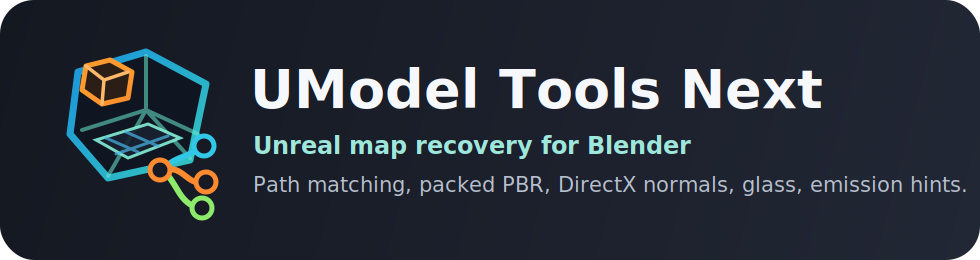
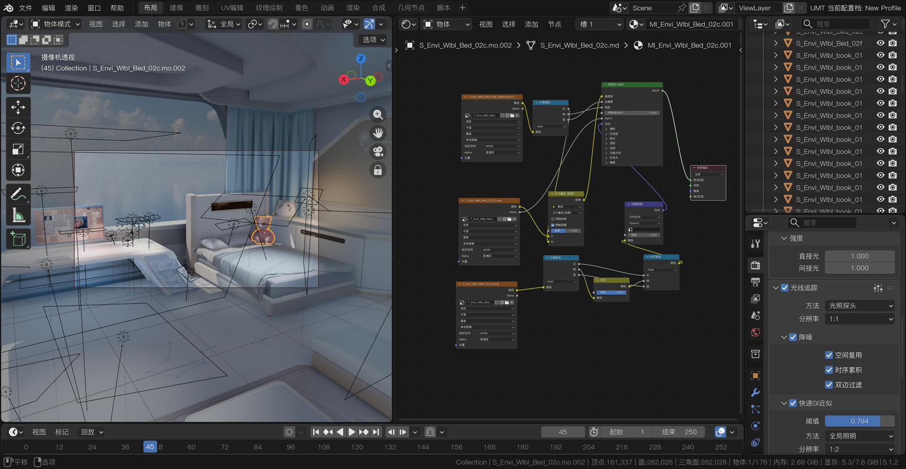

<p align="center">
  
</p>

# UModel Tools Next

UModel Tools Next is dotm5's fork of the UModel Tools Blender add-on.
It turns UModel and FModel map exports into a focused Blender scene recovery pipeline, with stronger path matching and layered shader-rule reconstruction for packed Unreal texture patterns.

Repository: https://github.com/dotm5/UModel_Tools_Next

## Why This Fork

- Recovers Unreal Engine map JSON exports into Blender scenes, including static mesh placement and reusable asset caches.
- Matches map assets across UModel/FModel-style export layouts and mixed path conventions.
- Reconstructs common packed PBR material layouts, with optional creator rule datasets for game-specific texture names and channel packing.
- Converts DirectX normal maps for Blender's OpenGL-style tangent space.
- Applies shader hints for glass, water, emissive, foliage-like alpha, and other Unreal material patterns.
- Produces missing-asset diagnostics so incomplete exports are easier to fix instead of silently failing.
- Keeps packaging lean: only runtime site packages are bundled, while fork-maintained reference importers live inline.
- Direct single-asset import and interactive AutoTex repair workflows are intentionally outside this add-on and can be split into a separate module later.

## Showcase



Imported Unreal map content in Blender, shown alongside the reconstructed material node graph for packed PBR textures, DirectX normal conversion, and shader routing.

## Features

- Map import from Unreal Engine JSON exports with static mesh placement.
- FModel-style World/Level/Actor/component reference traversal with template and parent-transform fallbacks.
- Engine BasicShapes recovery from exported meshes, with dependency-free procedural previews when those meshes are absent.
- Blender asset cache generation and reuse for repeated map recovery work.
- Optional experimental skeletal map preview with PSK/PSKX armatures and one basic `AnimToPlay` PSA Action; morph targets, animation blueprints, montages, retargeting, and root motion remain out of scope.
- UModel/FModel path inference for exports that do not share one exact directory shape.
- Map material reconstruction from Unreal material descriptors, FModel JSON, texture parameter patterns, and TOML rule datasets.
- Packed mask support, DirectX normal conversion, glass/water hints, and packed diffuse alpha emission masks.
- Missing-asset reports for diagnosing partial or inconsistent exports.

## Packaging

The distributed Blender add-on keeps only runtime site packages in `umodel_tools/third_party`.
Reference importer code that is part of this fork, such as the PSK/PSKX importer integration, lives inline under `umodel_tools` so the vendored dependency folder does not grow into a mixed plugin dump.
Built-in material rule datasets use TOML only and are parsed with Python's standard-library `tomllib`.
Generated material node trees are arranged with the vendored arrangebpy Sugiyama
core; packaged builds include NetworkX as its runtime graph dependency.
Build distributable copies without `--noreq` unless `umodel_tools/third_party`
has already been populated from `requirements.txt`.

## Material Rule Example

```toml
name = "ExampleRules"

[[texture_rules]]
name = "diffuse"
diffuse = true
[texture_rules.match]
param_names = ["base color", "diffuse"]
suffixes = ["d", "basecolor"]
[[texture_rules.connections]]
from = "image.Color"
to = "ao_mix.Color1"
```


## Credits

- Skarn for the original UModel Tools add-on.
- Gildor for [UEViewer](https://www.gildor.org/en/projects/umodel).
- Developers of [FModel](https://fmodel.app).
- Developers of the original UE map import scripts.
- Befzz for the Blender PSK/PSA importer foundation.

## Disclaimer

Game assets and maps are copyrighted by their respective owners.
This software is intended for artistic, archival, and research workflows.
