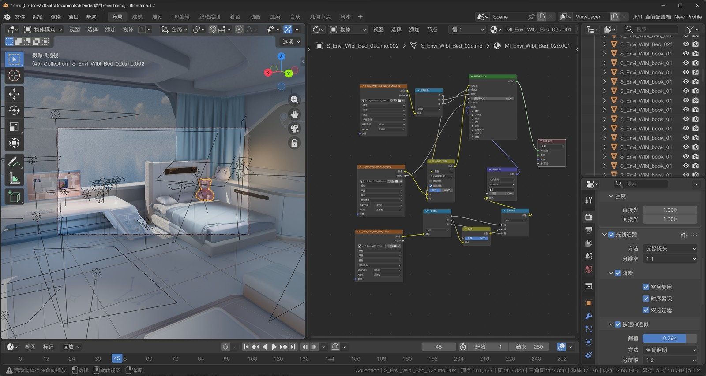

# UModel Tools Next

UModel Tools Next is dotm5's fork of the UModel Tools Blender add-on.
It focuses on practical Unreal Engine map recovery workflows, stronger UModel/FModel path matching, local-single-file imports, and broader material reconstruction for packed texture patterns.

Repository: https://github.com/dotm5/UModel_Tools_Next

## Showcase

Imported Unreal map content in Blender, shown alongside the reconstructed material node graph for packed PBR textures, DirectX normal conversion, and shader routing.

## Features

- Import Unreal Engine map JSON exports and static mesh assets into Blender.
- Build and reuse a Blender asset cache from UModel exports.
- Reconstruct PBR materials from common Unreal texture parameter patterns.
- Handle packed ORM/RMO maps, DirectX normal conversion, glass/water hints, and packed diffuse alpha emission masks.
- Generate missing-asset diagnostics for incomplete exports.

## Packaging

The distributed Blender add-on keeps only runtime site packages in `umodel_tools/third_party`.
Reference importer code that is part of this fork, such as the PSK/PSKX importer integration, lives inline under `umodel_tools` so the vendored dependency folder does not grow into a mixed plugin dump.

## Credits

- Skarn for the original UModel Tools add-on.
- Gildor for [UEViewer](https://www.gildor.org/en/projects/umodel).
- Developers of [FModel](https://fmodel.app).
- Developers of the original UE map import scripts.
- Befzz for the Blender PSK/PSA importer foundation.

## Disclaimer

Game assets and maps are copyrighted by their respective owners.
This software is intended for artistic, archival, and research workflows.
