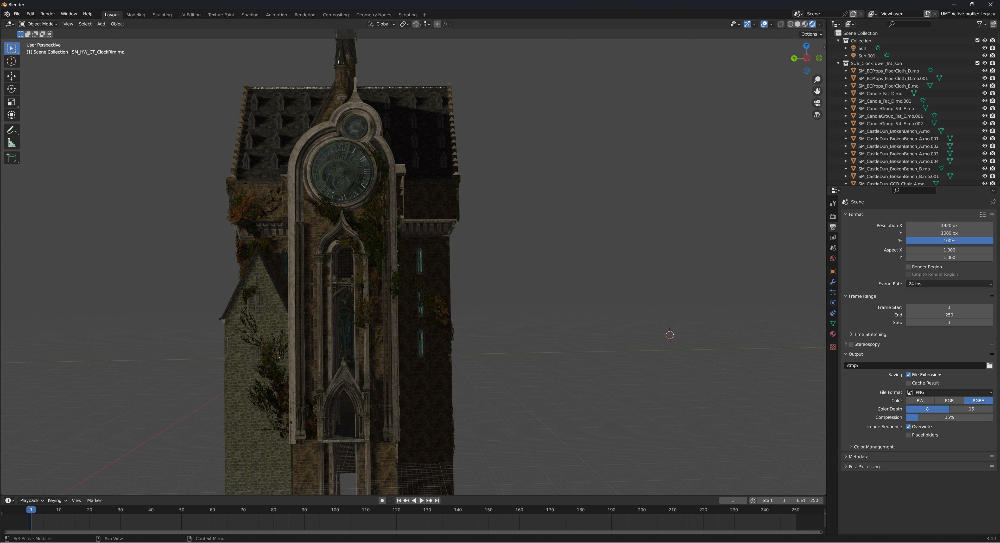

UModel Tools Next
========================================

Welcome to ``UModel Tools Next`` documentation.
`UModel Tools Next <https://github.com/dotm5/UModel_Tools_Next>`_
is dotm5's fork of the original ``umodel_tools`` `Blender <https://blender.org>`_ addon, focused on Unreal Engine
static mesh and map import workflows with expanded path matching and material reconstruction.

Overview
==================

.. toctree::
   :maxdepth: 2

   installation
   configuration
   usage
   supported_games
   create_game_profile

Indices and tables
==================

* :ref:`genindex`
* :ref:`modindex`
* :ref:`search`
